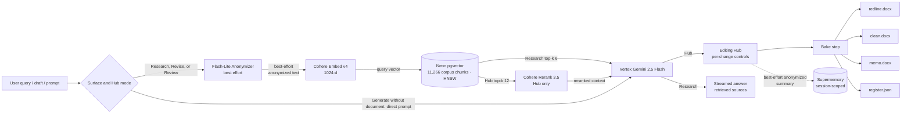

# Argus

**An M&A drafting and review demo built on Corrective RAG, Cohere retrieval, and Vertex Gemini.**

> The product is called **Argus**; the GitHub repo retains the original project name **LawAgent** to preserve clone URLs and inbound links. Both refer to the same codebase.

Generate a contract from a prompt, revise your own draft, or run a redline review against an M&A playbook grounded in the CUAD and MAUD academic datasets — all in one workspace, with inline track changes and downloadable Word artifacts.

- **Live demo:** [lawagent.nickvbattaglia.com](https://lawagent.nickvbattaglia.com)
- **Portfolio + case study:** [nickvbattaglia.com/projects/lawagent](https://nickvbattaglia.com/projects/lawagent)
- **Two surfaces:** the [Drafting & Review Hub](https://lawagent.nickvbattaglia.com/hub) and the [M&A Research Desk](https://lawagent.nickvbattaglia.com/research)

[](https://github.com/nick-battags/LawAgent/releases/tag/v1.1)
[](#license)
[](#tech-stack)

> Educational demo by a JD/MBA candidate. **Not a lawyer, not legal advice, no attorney-client privilege.**

---

## What it does

**Drafting & Review Hub** (`/hub`) — three intake modes that converge on the same editing interface:
- **Generate** — draft a contract from a prompt + posture (buy / sell / neutral)
- **Revise** — upload a draft + a revision prompt, get a marked-up version
- **Review** — upload a draft, get spotted issues without unsolicited rewrites

Each session produces four downloadable artifacts: `redline.docx` (native `<w:ins>`/`<w:del>` track changes), `clean.docx` (accepted changes baked in), `memo.docx` (issues + rationale + decisions log), and `register.json` (structured change records). Per-change accept / reject / edit controls in the side panel. Anchored chat that references the specific clause being discussed.

**M&A Research Desk** (`/research`) — a source-grounded interface for asking conversational questions about M&A drafting patterns. The legacy `/chat` URL remains a compatibility route for the same surface. Streamed answers are grounded in **11,266 corpus chunks** indexed in Neon pgvector:
- A curated 22-chunk playbook across 12 categories (assignment, indemnification, MAC, R&W, governing law, dispute resolution, termination, IP ownership, payment terms, liability cap, confidentiality, non-solicit)
- ~7,067 spans from the Contract Understanding Atticus Dataset (CUAD — clause-level annotations across 250+ contracts)
- ~4,177 spans from the Merger Agreement Understanding Dataset (MAUD — question-level annotations across ~150 M&A agreements)

Add a document under **Session sources** to ground the conversation in your own materials (per-session, session-scoped server-side TTL). Argus attempts to remove identifying details before retrieval, but this is best effort and may pass the original text through, so use public or fictional material only. Answers distinguish those uploads from the always-searched **Argus research library** and present the retrieved material as **Retrieved sources**.

---

## Architecture



Research and the document-backed Revise and Review modes attempt to remove
identifying details before retrieval. This anonymization is best effort: if
Flash-Lite is unavailable, the provider call fails, or the configured provider
is not Vertex, the workflow may continue with the original text. Generate
without a document sends its drafting prompt directly to Gemini and
intentionally skips anonymization and corpus retrieval. In every mode, do not
submit confidential or identifying information. The bake step writes
best-effort anonymized summaries to Supermemory only after a post-hoc PII
firewall re-check.

The verified route, workflow, and data-flow constraints for the renovation are
recorded in [docs/UI_RENOVATION.md](docs/UI_RENOVATION.md).

---

## Tech stack

Flask · Vertex AI Gemini 2.5 Flash + Flash-Lite · Cohere Embed v4 + Rerank 3.5 · Neon serverless Postgres with pgvector · Supermemory · python-docx + docx-revisions · Cloud Run · Cloudflare DNS + Pages · Astro 4 (portfolio).

| Concern | Choice | Why |
|---|---|---|
| Retrieval | Cohere Embed v4 + Rerank 3.5 over Neon pgvector | Best-in-class for legal text; rerank makes a Flash-Lite escalation grader unnecessary in steady state |
| Generator | Vertex Gemini 2.5 Flash | Long context, fast, cheap, no training on our data |
| Anonymizer | Vertex Gemini 2.5 Flash-Lite | 60–75% cheaper than Flash; per-session two-way pseudonym map in process memory only |
| Database | Neon (Free tier) | Serverless Postgres, scales to zero, pgvector support, $0/mo at portfolio traffic |
| Session memory | Supermemory (Free tier) | Per-session container tags keyed by session_id; anonymized writes only; server-side TTL managed at the Supermemory account level |
| Demo deploy | Cloud Run (us-central1) + Cloudflare DNS | Cloud Run hosts the Flask app behind `lawagent.nickvbattaglia.com`, with `min-instances=1` to eliminate cold start; Cloudflare proxies DNS |
| Portfolio deploy | Cloudflare Pages | Static Astro build at `nickvbattaglia.com`, auto-deployed on push |

Realistic cost: **~$3–8/month at portfolio traffic** (Cloud Run min-instances=1 baseline + Vertex/Cohere per-request + Neon free tier). A `$50` Cloud Billing alert is recommended as a kill-switch (filed as a v1.2 backlog item; see `docs/BACKLOG.md`). Rate limits and token caps are not currently enforced in app code — appropriate for a portfolio demo with sparse traffic; would need to be added before any wider release.

---

## Local development

The repo supports a fully offline path (Ollama + ChromaDB) for local dev that mirrors the cloud pipeline at the API level.

```bash
# Clone and enter the repo
git clone https://github.com/nick-battags/LawAgent.git
cd LawAgent

# Python env
python -m venv .venv
source .venv/bin/activate   # Windows: .\.venv\Scripts\Activate.ps1
pip install -r requirements.txt

# Pull local Ollama models (alternative to Vertex for offline dev)
ollama pull llama3.1:8b
ollama pull nomic-embed-text

# Run with the local stack
LLM_PROVIDER=ollama VECTOR_BACKEND=chromadb DEMO_MODE=false python app.py
# → http://localhost:5000/hub
```

To exercise the cloud stack locally instead, set the env vars per `deployment/.env.vps.example` and configure ADC for Vertex (`gcloud auth application-default login`).

---

## Production deployment

Single command from the repo root:

```bash
scripts/deploy.sh
```

This wraps `gcloud builds submit` + `gcloud run services update` with the
current environment and Secret Manager bindings. Treat the script as the
implementation source of truth until a separately reviewed production runbook
is added.

Required infrastructure (one-time):
- GCP project with Vertex AI, Cloud Run, Cloud Build, Secret Manager enabled
- Neon Postgres project with `pgvector` extension
- Cohere account with a production API key
- Supermemory account
- Cloudflare account managing the apex domain DNS
- Cloud Run service account with `roles/aiplatform.user`, `roles/secretmanager.secretAccessor`, `roles/storage.objectAdmin` (scoped to the demo bucket)

### Admin and observability

Admin is an environment-only maintenance surface, not a public Argus feature.
When `ADMIN_PIN` is absent, every `/admin*` page and Admin-only API returns an
empty `404`, including requests carrying stale Admin session state. When
`ADMIN_PIN` is configured, the existing PIN login remains available and
unauthenticated protected APIs return JSON `401`.

`run-lawagent.ps1` does not provide authentication defaults. Set a unique
`ADMIN_PIN` and `FLASK_SECRET_KEY` in the caller's process environment only
when local Admin access and persistent sessions are needed. Rotate any
previously reused launcher values; removing a value from the current file does
not remove it from Git history.

Production observability lives in the Cloud Run, Neon, Vertex, Cohere,
Supermemory, and Cloudflare provider dashboards. Do not enable Admin merely to
monitor production.

---

## Repository layout

```
LawAgent/
├── app.py                      — Flask routes (Hub + Research + landing + APIs)
├── scripts/
│   ├── hub_pipeline.py         — Three-mode Hub pipeline (generate / revise / review)
│   ├── hub_export.py           — Four-artifact bake (redline / clean / memo / register)
│   ├── llm_provider.py         — VertexProvider (Cohere + Gemini) + OllamaProvider
│   ├── pgvector_store.py       — Cohere-embedded pgvector retrieval
│   ├── supermemory_store.py    — Per-session Supermemory writes
│   ├── anonymizer.py           — Flash-Lite pseudonymization with 24h TTL map
│   ├── pii_firewall.py         — Regex-based PII gate (pre-LLM + post-anonymizer)
│   ├── context_loader.py       — Per-session document upload (NotebookLM-style)
│   ├── corpus/
│   │   ├── seed_playbook.py    — 22 curated playbook chunks
│   │   └── ingest_datasets.py  — CUAD + MAUD bulk ingest into pgvector
│   └── migrations/             — Postgres schema (vector(1024) for Cohere v4)
├── templates/                  — Jinja2 templates for / /hub /review /research /chat
├── static/                     — CSS (cream + burgundy palette) + JS (hub.js, chat.js)
├── prompts/                    — Versioned LLM prompts (generator, grader, rewriter)
├── tests/                      — pytest suite
├── deployment/                 — Dockerfile, gunicorn config, env templates
└── docs/                       — Architecture, runbook, costs, emergency (planned)
```

---

## License

MIT for the code in this repository. Sample fixtures and the curated playbook (`scripts/corpus/seed_playbook.py`) are original work distilled from publicly available M&A practice guides; the CUAD and MAUD datasets are CC BY 4.0 (Hendrycks et al. 2021 and Wang et al. 2023 respectively).

---

## Disclaimer

Argus is a portfolio demonstration tool built by a JD/MBA candidate for educational research on M&A contract drafting. It does **not** provide legal advice, does **not** establish an attorney-client relationship, and is **not** a substitute for counsel. Output should be verified by a licensed attorney before use.

**Built by [Nick Battaglia](https://nickvbattaglia.com)** — Indiana University Maurer School of Law (JD) + Kelley School of Business (MBA).
